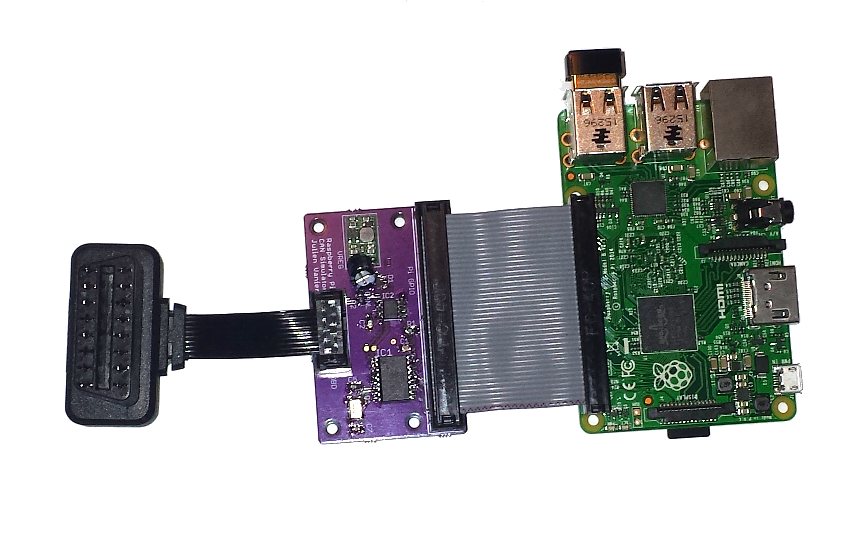

# CAN Simulator

This is a project we used to help develop and test the [Carloop][carloop] open-source car adapter. We hope you'll find it useful for your projects too.

## Overview

The simulator consists of:
- An OBD port (the same you have in your car under the steering wheel) to plug a device to test
- The simulator board to convert CAN voltages to logic levels and provide 12V on the OBD port
- A Raspberry Pi to run the simulator program
- [The program][simulator-program] that communicates with the simulator board and that decide what to do with the CAN messages received

## Background about CAN

CAN is the communication bus used between most computers in cars. It has several physical layers, including a high-speed differential voltage (CAN high and CAN low) at up to 1 Mbit/second. CAN is a multicast protocol where each message has an identifier and up to 8 data bytes. Any node listening on the bus can receive any message transmitted. In order to make sense of the messages, the receivers need to know the data format used by the transmitter of each message for the data bytes.

There are higher level protocols built on top of CAN, most importantly ISO 15765 used for OBD-II (On-Board Diagsnotics II) mandated on all cars since 2008 and used on many cars before. See [this tutorial by Sparkfun for more information about the OBD-II protocol][obd-getting-started]

This CAN simulator can be used to transmit and receive messages simulating OBD-II communications and regular vehicle messages.

## Simulator board

The heart of the simulator board is the [MCP2515 standalone CAN controller][mcp2515-datasheet] that understands the CAN protocol
and talks to the Raspberry Pi over the SPI bus.

The board also has a [TJA1049 CAN transceiver][tja1049-datasheet] to translate logic voltage levels to the differential voltage levels used for high speed CAN.

Since the OBD port is supposed to provide 12 volts, a simple [5V to 12V step up regulator from Pololu][12v-step-up-regulator] is included.

The OBD connector is part of an off-the-shelf [9-pin OBD ribbon extension cable available on Amazon][obd-cable].

- [Board schematics (PDF)](schematics) [(Eagle)](schematics-eagle)
- [Board layout (Eagle)][layout-eagle]
- [Bill of materials][bom]
- [MCP2515 CAN controller datasheet][mcp2515-datasheet]
- [TJA1049 CAN transceiver datasheet][tja1049-datasheet]

### Assembly instructions

- [Order a simulator v1 PCB from OSH Park.][pcb-osh-park]
- [Order the parts from the BOM from DigiKey][bom] and the [regulator from Pololu.][12v-step-up-regulator]
- Solder the above together.
- Get a Raspberry Pi with a GPIO connector.
- [Get an OBD cable.][obd-cable]
- Insert the 9-pin flat cable in the 10-pin insulation displacement connector aligned to the left (see the overview picture above) and cut the leftover cable.
- Flash the latest Raspian image to the SD card of your Raspberry PI and follow the instructions to get the simulator program running.

## [Simulator program][simulator-program]

The program running the simulation is in [a separate repository][simulator-program]. Currently it only sends fixed messages. It could be extended for more sophisticated communication or to replay logged CAN bus traces.

## License

Copyright 2016 Julien Vanier. Distributed under the MIT license. See [LICENSE](/LICENSE) for details.

[carloop]: https://www.carloop.io
[simulator-program]: https://github.com/carloop/simulator-program
[schematics]: eagle/CAN-Simulator_v1.pdf
[schematics-eagle]: eagle/CAN-Simulator_v1.sch
[layout-eagle]: eagle/CAN-Simulator_v1.brd
[bom]: eagle/CAN-Simulator_v1_BOM.csv
[obd-getting-started]: https://learn.sparkfun.com/tutorials/getting-started-with-obd-ii
[obd-cable]: https://www.amazon.com/gp/product/B00GGLVXG2/ref=oh_aui_detailpage_o02_s00?ie=UTF8&psc=1
[mcp2515-datasheet]: datasheets/MCP2515%20Datasheet.pdf
[tja1049-datasheet]: datasheets/TJA1049%20Datasheet.pdf
[12v-step-up-regulator]: https://www.pololu.com/product/2117
[pcb-osh-park]: https://oshpark.com/shared_projects/r7ItELkM
